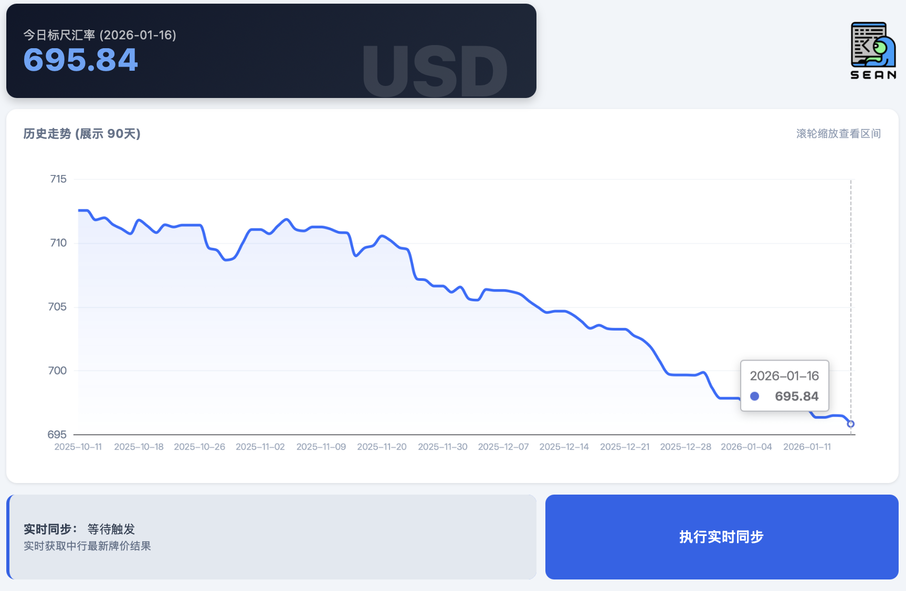

# USD 现汇买入价看板 (Flask + ECharts)

## 📌 项目简介

### 一个轻量级的Web汇率看板，支持从中国银行官网实时抓取美元（USD）对人民币（CNY）的现汇买入价，并支持定时任务、图表展示、手动刷新和后台管理功能。支持以下功能：

- 定时从中国银行官网抓取 USD/CNY 的现汇买入价数据；
- 自动保存到 SQLite 数据库；
- 使用 ECharts 展示近 7～90 天的历史走势；
- 显示每日最接近 9:30 的汇率作为“今日现汇买入价”；
- 页面底部按钮支持手动刷新汇率；
- 按钮旁显示最后一次抓取的汇率及时间；
- 支持图像嵌入展示看板页面截图。
 
 ```
                      定时/手动触发    
┌────────────┐                            ┌──────────────┐
│ APScheduler│──────────────────────────▶│ fetch_usd... │
└────────────┘                            └──────────────┘
        ▲                                       │
        │ parse->date,rate                      │
        │                                       ▼
    ┌──────────────┐                    ┌──────────────┐
    │  SQLite DB   │◀──────────────────│ insert/update│
    └──────────────┘                    └──────────────┘
        ▲                                       │
        │ /api/rates                            │
        │                                       ▼
    ┌──────────────┐                   前端 HTML+ECharts
    │  Flask App   │◀───────────────────────────────┐
    │ - Admin(CRUD)│                                 │
    │ - REST API   │                                 ▼
    └──────────────┘                  ┌───────────────────────┐
                                      │  User Browser Canvas  │
                                      └───────────────────────┘
```
---

## 📁 项目结构

```bash
your-project/
├── app.py                   # Flask 主程序
├── fetch_usd_rate.py        # 汇率数据抓取及定时任务
├── rates.db                 # SQLite 数据库
├── requirements.txt         # Python 依赖
├── templates/
│   ├── index.html           # 前端展示页面
│   └── admin.html           # 管理页面
├── static/
│   └── LOGO.PNG             # 页面 Logo，可自行更换
└── screenshot.png           # 看板页面截图
```

---

## 📦 安装依赖

### 🖥 macOS 本地运行

```bash
cd 项目文件夹路径  # 可直接拖动文件夹到终端
python3 -m venv venv
source venv/bin/activate
pip install -r requirements.txt
```

### 🪟 Windows 本地运行

```bash
python -m venv venv
venv\Scripts\activate
pip install -r requirements.txt
```

## 🚀 启动项目

### 🖥 macOS 本地运行

```bash
./venv/bin/python fetch_usd_rate.py  # 初始化数据库
./venv/bin/python app.py             # 启动 Flask 应用
```

### 🪟 Windows 本地运行

```bash
python fetch_usd_rate.py  # 初始化数据库
python app.py             # 启动 Flask 应用
```

- 浏览器访问 http://localhost:5050/ （或本机ip地址+：5050) 查看看板页面。
- 管理员后台 http://localhost:5050/admin

---

## 🧩 技术栈

- 后端：Flask
- 前端：ECharts + HTML5 + Tailwind CSS
- 数据：SQLite + APScheduler

---

## 📷 页面截图

- 页面顶部「今日现汇买入价」展示的是数据库中最接近每日 上午 9:30 的汇率数据。
- 页面底部「获取最新汇率」按钮可立即从中国银行官网抓取汇率。
- 按钮右侧会实时显示「最后抓取时间」和「抓取汇率」，便于比对。
- 鼠标滚轮支持缩放图表的时间区间（7～90 天）。

---

## ⏰ 数据来源与抓取逻辑
- 汇率来源：中国银行官网（https://www.boc.cn/sourcedb/whpj/）
- 每次抓取从中国银行汇率网页中解析出 USD 现汇买入价；
- 系统将保存抓取时间和汇率数据到 SQLite；
- 页面上方显示“今日 USD 现汇买入价”，即当日最接近 9:30 的数据；
- 页面底部按钮旁显示最近一次抓取的汇率信息（无论是否为当日）；
- 用户可手动点击按钮刷新数据；
    
---

## 📄 许可

MIT License
Copyright © 2025
