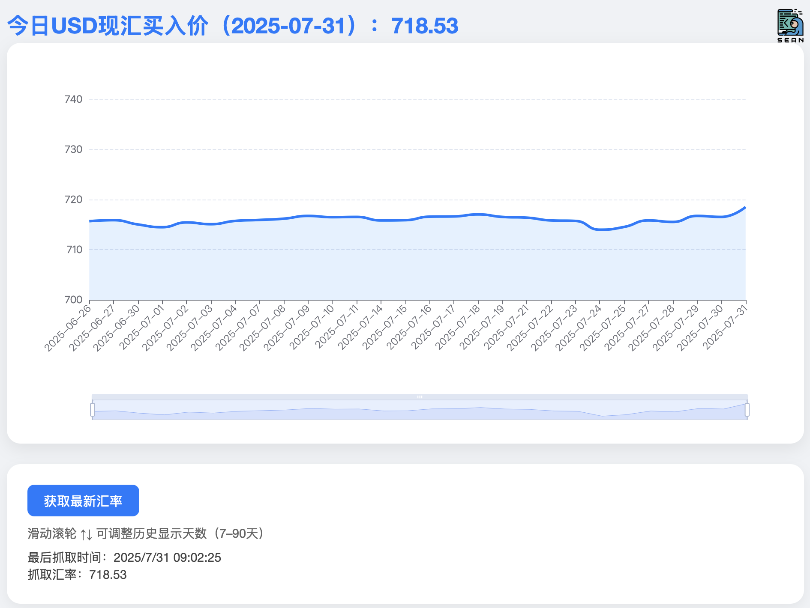

# USD 现汇买入价看板 (Flask + ECharts)



## 📌 项目简介

这是一个轻量级的网页看板系统，用于实时展示美元对人民币的现汇买入价。支持以下功能：

- 定时从中国银行官网抓取 USD/CNY 的现汇买入价数据；
- 自动保存到 SQLite 数据库；
- 使用 ECharts 展示近 7～90 天的历史走势；
- 显示每日最接近 9:30 的汇率作为“今日现汇买入价”；
- 页面底部按钮支持手动刷新汇率；
- 按钮旁显示最后一次抓取的汇率及时间；
- 支持图像嵌入展示看板页面截图。

---

## 📁 项目结构

```bash
.
├── app.py                 # 主 Flask 应用入口
├── fetch_usd_rate.py      # 汇率抓取与数据库处理脚本
├── templates/
│   └── index.html         # 前端页面模板（含图表、数据展示）
├── static/
│   └── logo.png           # 页面右上角的 logo 图标
├── usd_rates.db           # SQLite 数据库文件
└── 截屏2025-07-31 09.05.34.png  # 看板页面截图
```

---

## ⚙️ 安装与运行

### 1. 安装依赖

```bash
pip install flask requests beautifulsoup4 apscheduler
```

### 2. 启动服务

```bash
python app.py
```

浏览器访问 [http://127.0.0.1:5000](http://127.0.0.1:5000) 查看看板页面。

---

## 🔧 功能说明

### 汇率抓取逻辑：

- 每次抓取从中国银行汇率网页中解析出 USD 现汇买入价；
- 系统将保存抓取时间和汇率数据到 SQLite；
- 页面上方显示“今日 USD 现汇买入价”，即当日最接近 9:30 的数据；
- 页面底部按钮旁显示最近一次抓取的汇率信息（无论是否为当日）；
- 用户可手动点击按钮刷新数据；

---

## 🧩 技术栈

- 后端：Flask
- 前端：ECharts + HTML5 + Tailwind CSS
- 数据：SQLite + APScheduler

---

## 📷 页面截图

如图所示，展示每日最接近 9:30 的汇率数据，以及近 90 天的走势：


---

## 📄 许可

本项目基于 MIT 协议开源，仅供学习交流使用。
