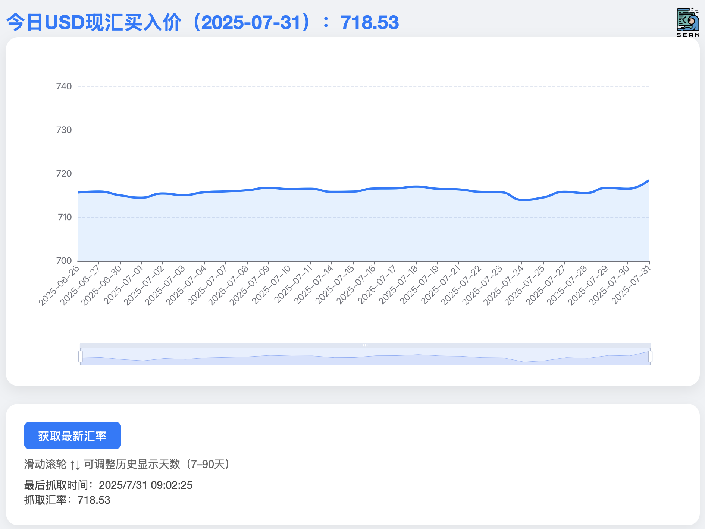

<details open>
<summary>📖 中文文档</summary>

# Daily-USD-CNY-Dashboard · 美元现汇买入价看板

> 📈 实时抓取中国银行美元（USD）对人民币（CNY）现汇买入价，图表展示历史走势，支持定时任务与后台管理。

---

## 📌 项目简介

一个轻量级的 Web 汇率看板，从中国银行官网实时抓取 USD/CNY 现汇买入价，并提供以下功能：

- 定时从中国银行官网抓取 USD/CNY 现汇买入价数据；
- 自动保存到 SQLite 数据库；
- 使用 ECharts 展示近 7～90 天的历史走势；
- 显示每日最接近 9:30 的汇率作为"今日现汇买入价"；
- 页面底部按钮支持手动刷新汇率；
- 按钮旁显示最后一次抓取的汇率及时间；

```
                     定时/手动触发    
┌────────────┐                            ┌──────────────┐
│ APScheduler│───────────────────────────▶│ fetch_usd... │
└────────────┘                            └──────────────┘
        ▲                                       │
        │ parse->date,rate                      │
        │                                       ▼
    ┌──────────────┐                    ┌──────────────┐
    │  SQLite DB   │◀───────────────────│ insert/update│
    └──────────────┘                    └──────────────┘
        ▲
        │ /api/rates
        │
    ┌──────────────┐                   前端 HTML+ECharts
    │  Flask App   │◀───────────────────────────────┐
    │ - Admin(CRUD)│                                │
    │ - REST API   │                                ▼
    └──────────────┘                  ┌───────────────────────┐
                                      │  User Browser Canvas  │
                                      └───────────────────────┘
```

---

## 📁 项目结构

```bash
Daily-USD-CNY-Dashboard/
├── app.py                   # Flask 主程序
├── fetch_usd_rate.py        # 汇率数据抓取及定时任务
├── rates.db                 # SQLite 数据库
├── requirements.txt         # Python 依赖
├── templates/
│   ├── index.html           # 前端展示页面
│   └── admin.html           # 管理页面
├── static/
│   └── LOGO.PNG             # 页面 Logo，可自行更换
└── screenshot.png           # 看板页面截图
```

---

## 🧩 技术栈

| 层级 | 技术 |
|---|---|
| 后端 | Flask |
| 前端 | ECharts + HTML5 + Tailwind CSS |
| 数据 | SQLite + APScheduler |

---

## 📦 安装依赖

**macOS / Linux**

```bash
python3 -m venv venv
source venv/bin/activate
pip install -r requirements.txt
```

**Windows**

```bash
python -m venv venv
venv\Scripts\activate
pip install -r requirements.txt
```

---

## 🚀 启动项目

**macOS / Linux**

```bash
./venv/bin/python fetch_usd_rate.py  # 初始化数据库
./venv/bin/python app.py             # 启动 Flask 应用
```

**Windows**

```bash
python fetch_usd_rate.py  # 初始化数据库
python app.py             # 启动 Flask 应用
```

浏览器访问 http://localhost:5050/ 查看看板页面，管理后台 http://localhost:5050/admin

---

## ⏰ 数据来源与抓取逻辑

- 汇率来源：中国银行官网 https://www.boc.cn/sourcedb/whpj/
- 每次抓取解析出 USD 现汇买入价，保存时间戳与汇率到 SQLite；
- 页面显示"今日 USD 现汇买入价"——即当日最接近 9:30 的数据；
- 用户可手动点击按钮立即触发抓取；

---

## 📷 页面截图



- 页面顶部「今日现汇买入价」展示数据库中最接近每日 9:30 的汇率；
- 「获取最新汇率」按钮可立即从中国银行官网抓取；
- 按钮右侧实时显示「最后抓取时间」和「抓取汇率」；
- 鼠标滚轮支持缩放图表时间区间（7～90 天）；

🔗 **静态演示**：https://trustlayer.free.nf/

---

## 📄 许可

MIT License © 2025

</details>

---

<details>
<summary>📖 English Documentation</summary>

# Daily-USD-CNY-Dashboard

> 📈 A lightweight web dashboard that fetches the USD/CNY buying rate from Bank of China in real time, with historical charts, scheduled tasks, and an admin panel.

---

## 📌 Overview

**Daily-USD-CNY-Dashboard** automatically scrapes and stores the USD/CNY spot buying rate published by Bank of China. Key features include:

- Scheduled scraping from the Bank of China website;
- Auto-save to SQLite database;
- ECharts-powered historical trend charts (7–90 days);
- Displays the rate closest to 9:30 AM each day as "Today's Rate";
- Manual refresh button at the bottom of the page;
- Shows the last scraped rate and timestamp next to the button;

```
               Scheduled / Manual Trigger
┌────────────┐                            ┌──────────────┐
│ APScheduler│───────────────────────────▶│ fetch_usd... │
└────────────┘                            └──────────────┘
        ▲                                       │
        │ parse -> date, rate                   │
        │                                       ▼
    ┌──────────────┐                    ┌──────────────┐
    │  SQLite DB   │◀───────────────────│ insert/update│
    └──────────────┘                    └──────────────┘
        ▲
        │ /api/rates
        │
    ┌──────────────┐                  Frontend HTML+ECharts
    │  Flask App   │◀───────────────────────────────┐
    │ - Admin(CRUD)│                                │
    │ - REST API   │                                ▼
    └──────────────┘                  ┌───────────────────────┐
                                      │  User Browser Canvas  │
                                      └───────────────────────┘
```

---

## 📁 Project Structure

```bash
Daily-USD-CNY-Dashboard/
├── app.py                   # Flask main application
├── fetch_usd_rate.py        # Rate scraper & scheduler
├── rates.db                 # SQLite database
├── requirements.txt         # Python dependencies
├── templates/
│   ├── index.html           # Dashboard page
│   └── admin.html           # Admin panel
├── static/
│   └── LOGO.PNG             # Page logo (replaceable)
└── screenshot.png           # Dashboard screenshot
```

---

## 🧩 Tech Stack

| Layer | Technology |
|---|---|
| Backend | Flask |
| Frontend | ECharts + HTML5 + Tailwind CSS |
| Data | SQLite + APScheduler |

---

## 📦 Installation

**macOS / Linux**

```bash
python3 -m venv venv
source venv/bin/activate
pip install -r requirements.txt
```

**Windows**

```bash
python -m venv venv
venv\Scripts\activate
pip install -r requirements.txt
```

---

## 🚀 Running the App

**macOS / Linux**

```bash
./venv/bin/python fetch_usd_rate.py  # Initialize database
./venv/bin/python app.py             # Start Flask server
```

**Windows**

```bash
python fetch_usd_rate.py  # Initialize database
python app.py             # Start Flask server
```

Open http://localhost:5050/ for the dashboard, and http://localhost:5050/admin for the admin panel.

---

## ⏰ Data Source & Scraping Logic

- Source: Bank of China — https://www.boc.cn/sourcedb/whpj/
- Each scrape parses the USD spot buying rate and saves timestamp + rate to SQLite;
- "Today's Rate" displayed on the page is the entry closest to 9:30 AM each day;
- Users can trigger a manual fetch at any time via the refresh button;

---

## 📷 Screenshot


- Top section shows "Today's USD Spot Buying Rate" — the record closest to 9:30 AM in the database;
- "Fetch Latest Rate" button triggers an immediate scrape from Bank of China;
- Last scraped rate and timestamp are shown beside the button;
- Mouse scroll zooms the chart time range (7–90 days);

🔗 **Live Demo**: https://trustlayer.free.nf/

---

## 📄 License

MIT License © 2025

</details>
