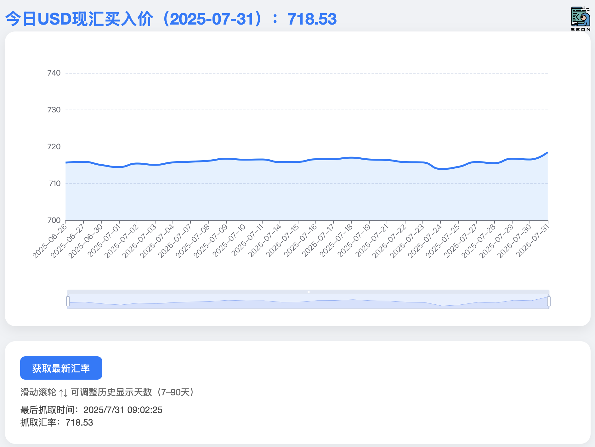

# Daily-USD-CNY-Dashboard · 美元现汇买入价看板

> 自动抓取中国银行 USD/CNY 现汇买入价，Flask + ECharts 驱动的汇率监控看板，内置定时抓取、SQLite 持久化、7～90 天走势图与管理后台，Docker 一键部署。

[](https://flask.palletsprojects.com/)
[](https://www.python.org/)
[](https://www.docker.com/)
[](https://www.sqlite.org/)
[](https://echarts.apache.org/)
[](./LICENSE)

**关键词 / Keywords**：美元汇率看板 · 人民币汇率监控 · USD CNY exchange rate dashboard · Bank of China rate scraper · 现汇买入价查询 · Flask 汇率监控 · ECharts 汇率走势图 · SQLite 数据持久化 · boc exchange rate · USD/CNY history chart

🔗 **静态在线演示**：https://trustlayer.free.nf/ （每日自动同步数据的纯前端版本）

## 🚀 快速部署

### Docker Compose（推荐）

```bash
git clone https://github.com/sean198604/Daily-USD-CNY-Dashboard.git
cd Daily-USD-CNY-Dashboard
docker compose up -d --build
```

启动后访问 http://localhost:5050/（看板）/ http://localhost:5050/admin（管理后台）。
`rates.db` 已通过卷挂载持久化，容器重建数据不丢失。

### 本地开发

```bash
python -m venv venv
venv/Scripts/activate        # macOS / Linux: source venv/bin/activate
pip install -r requirements.txt

python fetch_usd_rate.py     # 初始化数据库并抓取一次
python app.py                # 启动 Flask 应用（端口 5050）
```

## 📸 界面截图



- 顶部「今日汇率」展示数据库中每日最接近 9:25 的现汇买入价；
- 「获取最新汇率」按钮一键从中国银行官网抓取，旁侧实时显示最后抓取时间与汇率；
- 鼠标滚轮缩放图表时间区间（7～90 天）；
- 📊 走势图支持数据缩放、区间选型与 tooltip 悬浮查看每日数值。

## ✨ 核心特性

**数据抓取**
- 定时（APScheduler）+ 手动双通道抓取中国银行官网 USD 现汇买入价；
- 每次抓取保存时间戳与汇率至 SQLite，历史数据持续积累；
- 以当日最接近 9:25 的数据作为「今日汇率」，贴合开盘参考价。

**可视化看板**
- ECharts 历史走势折线图，7～90 天任意缩放；
- 零外部 CDN 依赖（echarts.min.js 已本地化，内网 / 国内网络环境秒开）；
- 自定义 favicon 与页面 Logo，可整体换肤。

**管理后台**
- `/admin` 提供记录增删改查（CRUD），可直接修正脏数据；
- REST API 输出，便于二次开发或对接其他前端。

**可选：静态版同步**
- `upload_via_ftp_final.py` 一键导出按日期去重的 `data.json` 并 FTP 上传到任意静态托管（如 InfinityFree），实现免服务器公开访问。

## ⚙️ 环境变量

| 变量 | 说明 | 必填 |
| --- | --- | --- |
| `FTP_HOST` | 静态版同步的 FTP 主机（如 ftpupload.net） | 可选 |
| `FTP_USER` | FTP 用户名 | 可选 |
| `FTP_PASS` | FTP 密码 | 可选 |

> 仅在使用 `upload_via_ftp_final.py` 同步静态版时需要；主看板零配置即可跑。

## 📡 API 速览

| 方法 | 路径 | 说明 |
| --- | --- | --- |
| GET | `/api/rates?days=N` | 返回近 N 天（默认 30）的历史汇率 JSON |
| POST | `/api/fetch` | 立即触发一次抓取并入库 |
| GET | `/` | 看板页面 |
| GET | `/admin` | 管理后台页面 |
| POST | `/admin/add` | 新增一条汇率记录 |
| POST | `/admin/delete/<id>` | 删除指定汇率记录 |

## 🏗 设计要点

```
                     定时/手动触发
┌────────────┐                            ┌──────────────┐
│ APScheduler│───────────────────────────▶│ fetch_usd... │
└────────────┘                            └──────────────┘
        ▲                                       │
        │ parse->date,rate                      ▼
    ┌──────────────┐                    ┌──────────────┐
    │  SQLite DB   │◀───────────────────│ insert/update│
    └──────────────┘                    └──────────────┘
        ▲
        │ /api/rates
    ┌──────────────┐                   前端 HTML+ECharts
    │  Flask App   │◀───────────────────────────────┐
    │ - Admin(CRUD)│                                ▼
    │ - REST API   │                  ┌───────────────────────┐
    └──────────────┘                  │  User Browser Canvas  │
                                      └───────────────────────┘
```

1. **单一 SQLite 文件即全部状态**——备份 = 复制 `rates.db`，迁移零成本；
2. **抓取与展示解耦**——抓取失败不影响历史数据展示，看板永远有数据可看；
3. **前端零外部依赖**——ECharts 本地化后，页面在内网、断外网环境下同样秒开；
4. **Docker 卷挂载数据库**——容器随时重建，数据跨版本持久保留。

## 🛠 FAQ

- **容器重建后数据消失？** → `docker-compose.yml` 已将 `rates.db` 挂载为卷，正常重建不会丢；若手动删卷则需重跑 `fetch_usd_rate.py` 重新积累。
- **页面一直转圈圈打不开？** → 检查是否加载外部 CDN；本项目已将 ECharts 本地化到 `static/echarts.min.js`，无此问题。
- **局域网其他设备访问不了？** → 用本机局域网 IP 访问（如 `http://192.168.x.x:5050`），并放行 Windows 防火墙 5050 端口。
- **抓取失败？** → 中国银行官网偶发限流，等待定时任务自动重试即可。
- **想部署一个免服务器的公开版？** → 运行 `upload_via_ftp_final.py` 导出 `data.json` 并 FTP 上传到任意静态托管。

## English

**Daily-USD-CNY-Dashboard** is a lightweight exchange-rate dashboard that automatically scrapes the USD/CNY spot buying rate from the Bank of China website, stores it in SQLite, and visualizes 7–90 day trends with ECharts. It ships with scheduled fetching (APScheduler), manual refresh, an admin CRUD panel, fully localized frontend assets (no CDN dependency), and one-command Docker deployment.

**Quick start**

```bash
git clone https://github.com/sean198604/Daily-USD-CNY-Dashboard.git
cd Daily-USD-CNY-Dashboard
docker compose up -d --build
# open http://localhost:5050/
```

**Features**

- Scheduled + manual scraping of the Bank of China USD spot buying rate;
- SQLite persistence with Docker volume mounting (data survives rebuilds);
- ECharts historical trend chart with scroll-zoom (7–90 days);
- "Today's rate" = the record closest to 9:25 AM each day;
- Admin CRUD panel at `/admin` and a REST API at `/api/rates`;
- Optional one-click export to `data.json` + FTP upload for a serverless static version.

**Live static demo**: https://trustlayer.free.nf/

## License

MIT © 2025
